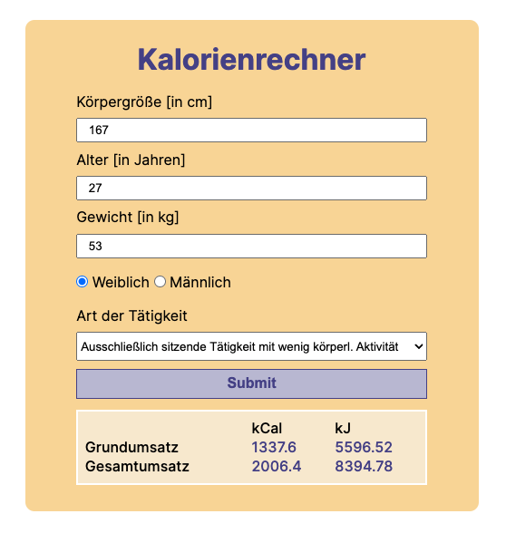

# Calorie Calculator

- the calorie calculator calculates your daily basal metabolic rate and total metabolic rate.
- each in the unit Kcal and kJ

## Link

https://cecilestaller.github.io/js-project-calorieCalculator/

## Tools

- HTML5
- SCSS
- JavaScript

## Screenzize

- The calorie calcultor can be used on all screensizes

## Scrrenshot

